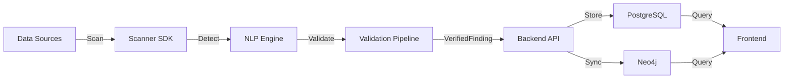

# System Architecture

## Executive Summary

The platform is an enterprise-grade Data Intelligence and Risk Management system designed to discover, classify, and track Personally Identifiable Information (PII) across heterogeneous data sources. Built on an **Intelligence-at-Edge** architecture, the system ensures that all data classification and validation occurs at the scanning layer, with downstream components acting as passive consumers of verified intelligence.

**Version**: 2.1.0  
**Architecture Pattern**: Modular Monolith  
**Deployment Model**: Hybrid (On-Premise / Cloud-Agnostic)

---

## Core Architectural Principles

### 1. Intelligence-at-Edge
All PII detection, validation, and classification logic resides in the **Scanner SDK**. The backend and frontend are **read-only consumers** of verified findings, ensuring:
- **Single Source of Truth**: Scanner SDK is the sole authority for PII classification
- **No Backend Validation**: Backend performs zero regex matching or algorithmic validation
- **Immutable Findings**: Once validated by the scanner, findings cannot be reclassified downstream

### 2. Unidirectional Data Flow
```
Scanner SDK → Backend API → PostgreSQL → Neo4j → Frontend Dashboard
     ↓              ↓            ↓          ↓            ↓
  Validate      Ingest       Store      Graph      Visualize
```

### 3. Modular Monolith Design
The backend follows a **domain-driven modular architecture** with clear boundaries:
- **Scanning Module**: Ingestion and classification orchestration
- **Assets Module**: Asset lifecycle management
- **Lineage Module**: Graph-based relationship tracking
- **Compliance Module**: Regulatory posture reporting
- **Masking Module**: Data anonymization services
- **Analytics Module**: Risk heatmaps and insights
- **Connections Module**: External system orchestration

Each module is independently deployable and testable, enabling future extraction into microservices if needed.

---

## System Components

### 1. Scanner SDK (Python)

**Purpose**: Autonomous PII detection and validation engine

**Key Responsibilities**:
- Multi-source scanning (Filesystem, PostgreSQL, MySQL, MongoDB, S3, GCS, Redis, Slack, etc.)
- NLP-based entity recognition using lightweight language models
- Mathematical validation (Verhoeff, Luhn, PAN checksum algorithms)
- Format validation (regex patterns for Indian PII types)
- Context extraction (surrounding text analysis)
- Verified finding generation

**Technology Stack**:
- **Language**: Python 3.9+
- **NLP Engine**: spaCy with `en_core_web_sm` model (small footprint)
- **Entity Recognition**: Custom pattern recognizers for 11 locked PII types
- **Validation**: Mathematical algorithms (Verhoeff, Luhn, Modulo 26)
- **Output Format**: JSON (VerifiedFinding schema)

**Locked PII Types** (India-Specific):
1. `IN_AADHAAR` - Aadhaar Number (12 digits, Verhoeff checksum)
2. `IN_PAN` - Permanent Account Number (10 chars, Weighted Modulo 26)
3. `IN_PASSPORT` - Indian Passport Number
4. `IN_VOTER_ID` - Voter ID (EPIC)
5. `IN_DRIVING_LICENSE` - Driving License
6. `IN_PHONE` - Indian Phone Number (10 digits)
7. `IN_UPI` - UPI ID (format: user@bank)
8. `IN_IFSC` - IFSC Code (11 chars)
9. `IN_BANK_ACCOUNT` - Bank Account Number
10. `CREDIT_CARD` - Credit/Debit Card (Luhn validation)
11. `EMAIL_ADDRESS` - Email Address

**Memory Footprint**: ~500-800MB (optimized with small NLP model)

---

### 2. Backend API (Go)

**Purpose**: Central orchestration and data persistence layer

**Architecture Pattern**: Clean Architecture with Modular Monolith

**Directory Structure**:
```
apps/backend/
├── cmd/
│   └── server/          # Application entry point
├── modules/
│   ├── scanning/        # Scan ingestion & classification
│   ├── assets/          # Asset management
│   ├── lineage/         # Graph lineage services
│   ├── compliance/      # Posture reporting
│   ├── masking/         # Data anonymization
│   ├── analytics/       # Risk analytics
│   ├── connections/     # External integrations
│   └── shared/          # Cross-cutting concerns
│       ├── config/      # Configuration management
│       ├── domain/      # Domain entities
│       ├── infrastructure/  # Database clients
│       └── interfaces/  # Module contracts
└── migrations_versioned/  # Database migrations
```

**Key Modules**:

#### Scanning Module
- **Ingestion Service**: Processes scanner output, normalizes findings
- **Classification Service**: Maps PII types to DPDPA categories
- **Enrichment Service**: Adds contextual metadata
- **API Handlers**: REST endpoints for scan submission

#### Lineage Module
- **Semantic Lineage Service**: Builds 3-level graph hierarchy
- **Neo4j Synchronization**: Syncs assets and findings to graph database
- **Graph Query Service**: Retrieves lineage relationships

#### Assets Module
- **Asset Repository**: CRUD operations for data assets
- **Risk Scoring**: Calculates asset risk based on findings
- **Deduplication**: Stable ID generation for asset normalization

**Technology Stack**:
- **Language**: Go 1.24
- **Web Framework**: Gin (HTTP router)
- **Database Driver**: lib/pq (PostgreSQL), neo4j-go-driver (Neo4j)
- **Migration Tool**: golang-migrate
- **Configuration**: godotenv (environment variables)

**API Endpoints**:
```
POST   /api/v1/scans/ingest-verified    # Ingest verified findings
GET    /api/v1/scans/:id                # Get scan status
GET    /api/v1/lineage                  # Retrieve lineage graph
GET    /api/v1/classification/summary   # PII classification summary
GET    /api/v1/findings                 # Query findings with filters
GET    /api/v1/assets                   # List assets
POST   /api/v1/lineage/sync             # Trigger manual sync
GET    /health                          # Health check
```

**Performance Characteristics**:
- **Request Timeout**: 15 seconds (read/write)
- **Idle Timeout**: 60 seconds
- **Concurrent Requests**: Unlimited (Gin default)
- **Database Connection Pool**: 25 max connections

---

### 3. Graph Database (Neo4j)

**Purpose**: Semantic lineage and relationship visualization

**Hierarchy Model** (3-Level - Frozen Semantic Contract):
```
System (e.g., PostgreSQL Database, File System)
  ↓ SYSTEM_OWNS_ASSET
Asset (e.g., users_table, customer_data.csv)
  ↓ ASSET_CONTAINS_PII
PII_Category (e.g., IN_AADHAAR, CREDIT_CARD)
```

**Node Types**:
1. **System**: Data source systems (databases, file systems, cloud storage)
   - Properties: `name`, `type`, `host`, `environment`
   
2. **Asset**: Individual data containers (tables, files, collections)
   - Properties: `stable_id`, `name`, `path`, `asset_type`, `risk_score`, `total_findings`
   
3. **PII_Category**: Specific PII types detected
   - Properties: `pii_type`, `dpdpa_category`, `requires_consent`, `risk_level`, `finding_count`, `avg_confidence`

**Edge Types**:
- `SYSTEM_OWNS_ASSET`: Links systems to their assets
- `ASSET_CONTAINS_PII`: Links assets to PII categories found within them

**Query Performance**:
- **Average Query Time**: 50-150ms (3-level hierarchy)
- **Graph Traversal**: O(n) complexity (linear with asset count)
- **Index Strategy**: Indexed on `stable_id`, `pii_type`, `risk_level`

**Migration from 4-Level to 3-Level** (v2.1.0):
- **Removed**: Intermediate `DataCategory` abstraction layer
- **Performance Gain**: 30-40% improvement in query speed
- **Code Reduction**: 790 lines of legacy code removed

---

### 4. Relational Database (PostgreSQL)

**Purpose**: Canonical storage for all findings, assets, and metadata

**Schema Overview**:

#### Core Tables
1. **scan_runs**: Tracks each scan execution
   - Primary Key: `id` (UUID)
   - Indexes: `profile_name`, `scan_started_at`, `status`

2. **assets**: Normalized data assets with stable identifiers
   - Primary Key: `id` (UUID)
   - Unique Key: `stable_id` (SHA-256 hash of asset identifier)
   - Indexes: `stable_id`, `asset_type`, `data_source`, `risk_score`

3. **findings**: Individual PII detections
   - Primary Key: `id` (UUID)
   - Foreign Keys: `scan_run_id`, `asset_id`, `pattern_id`
   - Indexes: `scan_run_id`, `asset_id`, `severity`, `created_at`

4. **classifications**: PII classification metadata
   - Primary Key: `id` (UUID)
   - Foreign Key: `finding_id`
   - Indexes: `finding_id`, `classification_type`, `confidence_score`

5. **patterns**: Detection pattern definitions
   - Primary Key: `id` (UUID)
   - Unique Key: `name`

6. **asset_relationships**: Graph edges between assets
   - Primary Key: `id` (UUID)
   - Foreign Keys: `source_asset_id`, `target_asset_id`
   - Unique Constraint: `(source_asset_id, target_asset_id, relationship_type)`

**Data Retention**:
- **Findings**: Retained indefinitely (audit trail)
- **Scan Runs**: Retained for 90 days (configurable)
- **Assets**: Retained until explicitly deleted

**Performance Optimizations**:
- **Indexes**: 15 strategic indexes for query optimization
- **Triggers**: Automatic `updated_at` timestamp management
- **Cascading Deletes**: Automatic cleanup of dependent records

---

### 5. Frontend Dashboard (Next.js)

**Purpose**: Read-only visualization and analytics interface

**Technology Stack**:
- **Framework**: Next.js 14.0.4 (React 18.2.0)
- **Language**: TypeScript 5.3.3
- **Graph Visualization**: ReactFlow 11.10.3, Cytoscape 3.33.1
- **HTTP Client**: Axios 1.6.2
- **Styling**: CSS Modules (no Tailwind)

**Key Features**:
1. **Dashboard Overview**: High-level metrics and risk summary
2. **Lineage Map**: Interactive graph visualization of data relationships
3. **Findings Explorer**: Searchable, filterable findings table
4. **Asset Inventory**: Comprehensive asset catalog
5. **Compliance Posture**: DPDPA compliance reporting
6. **Risk Heatmaps**: Visual risk distribution across assets

**Component Architecture**:
```
app/
├── dashboard/           # Main dashboard page
├── lineage/            # Lineage visualization
├── findings/           # Findings explorer
├── assets/             # Asset inventory
└── compliance/         # Compliance reports

components/
├── LineageGraph/       # Graph rendering
├── FindingsTable/      # Findings display
├── RiskHeatmap/        # Risk visualization
└── AssetCard/          # Asset summary cards

services/
├── api.ts              # API client
├── lineage.api.ts      # Lineage-specific API
└── findings.api.ts     # Findings-specific API
```

**State Management**: React hooks (no Redux/MobX)  
**Routing**: Next.js App Router  
**Data Fetching**: Client-side with Axios (no SSR for sensitive data)

---

## Data Flow Architecture

### End-to-End Scan Workflow



### Detailed Flow

1. **Scanning Phase**
   - Scanner SDK connects to configured data sources
   - Extracts text content from files, database columns, cloud storage
   - Feeds text to NLP engine for entity recognition
   - Generates candidate PII matches

2. **Validation Phase**
   - Each candidate match is validated using mathematical algorithms
   - Invalid matches are rejected (not sent to backend)
   - Valid matches are wrapped in `VerifiedFinding` schema
   - Context extraction (±50 characters around match)

3. **Ingestion Phase**
   - Scanner POSTs JSON payload to `/api/v1/scans/ingest-verified`
   - Backend validates request schema
   - Creates/updates `scan_runs`, `assets`, `findings`, `classifications`
   - Generates stable IDs for asset deduplication

4. **Lineage Synchronization**
   - Backend triggers Neo4j sync after ingestion
   - Creates `System`, `Asset`, `PII_Category` nodes
   - Establishes `SYSTEM_OWNS_ASSET`, `ASSET_CONTAINS_PII` edges
   - Calculates risk levels and aggregates finding counts

5. **Visualization Phase**
   - Frontend queries `/api/v1/lineage` for graph data
   - Renders interactive lineage map using ReactFlow
   - Displays findings in searchable table
   - Shows compliance posture and risk heatmaps

---

## Deployment Architecture

### Development Environment
```
┌─────────────────────────────────────────────┐
│  Developer Machine                          │
│  ┌─────────────┐  ┌──────────────┐         │
│  │ Frontend    │  │ Backend      │         │
│  │ (npm dev)   │  │ (go run)     │         │
│  │ :3000       │  │ :8080        │         │
│  └─────────────┘  └──────────────┘         │
│                                             │
│  ┌─────────────────────────────────────┐   │
│  │ Docker Compose                      │   │
│  │ ┌──────────┐ ┌────────┐ ┌────────┐ │   │
│  │ │PostgreSQL│ │ Neo4j  │ │ NLP    │ │   │
│  │ │  :5432   │ │ :7687  │ │ Engine │ │   │
│  │ └──────────┘ └────────┘ └────────┘ │   │
│  └─────────────────────────────────────┘   │
└─────────────────────────────────────────────┘
```

### Production Environment
```
┌─────────────────────────────────────────────┐
│  Load Balancer (Nginx/HAProxy)              │
└────────────────┬────────────────────────────┘
                 │
    ┌────────────┴────────────┐
    │                         │
┌───▼────┐              ┌─────▼───┐
│Backend │              │Frontend │
│Cluster │              │ (Static)│
│(Go)    │              │         │
└───┬────┘              └─────────┘
    │
    ├──────────┬──────────┐
    │          │          │
┌───▼────┐ ┌──▼────┐ ┌───▼────┐
│Postgres│ │ Neo4j │ │ NLP    │
│Primary │ │Cluster│ │ Engine │
└────────┘ └───────┘ └────────┘
    │
┌───▼────────┐
│Postgres    │
│Replica(s)  │
└────────────┘
```

---

## Security Architecture

### Data Protection
1. **PII Hashing**: All PII values are SHA-256 hashed before storage
2. **No Raw PII Storage**: Only hashes and context excerpts are persisted
3. **Access Control**: Role-based access control (RBAC) for API endpoints
4. **Encryption at Rest**: PostgreSQL and Neo4j data encrypted
5. **TLS/SSL**: All network communication encrypted

### Authentication & Authorization
- **API Authentication**: JWT-based token authentication (future enhancement)
- **Database Authentication**: Username/password with connection pooling
- **Neo4j Authentication**: Username/password with bolt protocol

### Audit Trail
- **Scan History**: Complete audit trail of all scan executions
- **Finding Provenance**: Traceable back to source scan and pattern
- **Review States**: Track manual review and approval workflows

---

## Scalability Considerations

### Horizontal Scaling
- **Backend**: Stateless API servers (scale horizontally behind load balancer)
- **PostgreSQL**: Read replicas for query scaling
- **Neo4j**: Causal clustering for high availability
- **Scanner**: Distributed scanning across multiple workers

### Vertical Scaling
- **Database**: Increase CPU/RAM for query performance
- **Neo4j**: Increase heap size for large graphs (currently 2GB)
- **Backend**: Increase connection pool size

### Performance Bottlenecks
1. **Neo4j Sync**: Synchronous sync can slow ingestion (mitigated with async workers)
2. **Large Scans**: Scans with >100K findings may require batching
3. **Graph Queries**: Deep traversals (>3 levels) can be slow (mitigated by 3-level hierarchy)

---

## Monitoring & Observability

### Health Checks
- **Backend**: `GET /health` endpoint (200 OK if healthy)
- **PostgreSQL**: Connection pool health monitoring
- **Neo4j**: Cypher query health check

### Metrics (Future Enhancement)
- Request latency (p50, p95, p99)
- Error rates by endpoint
- Database query performance
- Scan throughput (findings/second)

### Logging
- **Backend**: Structured JSON logs to stdout
- **Scanner**: Verbose debug logs (optional `--debug` flag)
- **Database**: Query logs for slow queries (>1s)

---

## Disaster Recovery

### Backup Strategy
- **PostgreSQL**: Daily full backups + WAL archiving
- **Neo4j**: Weekly graph dumps
- **Configuration**: Version-controlled in Git

### Recovery Procedures
1. **Database Restore**: Restore from latest backup
2. **Lineage Rebuild**: Re-sync all assets to Neo4j from PostgreSQL
3. **Scan Re-execution**: Re-run scans if findings are lost

---

## Technology Decisions

### Why Go for Backend?
- **Performance**: Compiled language with low latency
- **Concurrency**: Goroutines for efficient I/O handling
- **Type Safety**: Strong typing reduces runtime errors
- **Ecosystem**: Excellent database drivers and web frameworks

### Why Python for Scanner?
- **NLP Libraries**: Rich ecosystem (spaCy, NLTK)
- **Flexibility**: Easy integration with diverse data sources
- **Rapid Development**: Fast iteration on detection logic

### Why Neo4j for Lineage?
- **Graph Queries**: Native support for relationship traversal
- **Cypher**: Expressive query language for graph patterns
- **Visualization**: Excellent tooling for graph exploration

### Why PostgreSQL for Storage?
- **ACID Compliance**: Strong transactional guarantees
- **JSON Support**: JSONB for flexible metadata storage
- **Mature Ecosystem**: Battle-tested in production environments

---

## Architectural Evolution

### Version 1.0 (Initial Release)
- 4-level lineage hierarchy (System → Asset → DataCategory → PII_Category)
- Backend-based classification logic
- Monolithic architecture

### Version 2.0 (Intelligence-at-Edge)
- Scanner SDK as sole classification authority
- Backend becomes passive consumer
- Mathematical validation in scanner

### Version 2.1 (3-Level Hierarchy)
- Simplified lineage model (removed DataCategory layer)
- 30-40% performance improvement
- 790 lines of code removed

### Future (Microservices)
- Extract modules into independent services
- Event-driven architecture with message queue
- Distributed tracing and observability
