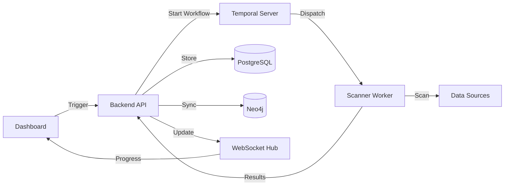

# System Architecture

## Executive Summary

The platform is an enterprise-grade Data Intelligence and Risk Management system designed to discover, classify, and track Personally Identifiable Information (PII) across heterogeneous data sources. Built on an **Event-Driven, Orchestrated Architecture**, the system ensures reliable, scalable, and resilient processing of scanning and remediation tasks.

**Version**: 1.0.0 (Production Ready)  
**Architecture Pattern**: Modular Monolith with Temporal Orchestration  
**Deployment Model**: Hybrid (On-Premise / Cloud-Agnostic)

---

## Core Architectural Principles

### 1. Intelligence-at-Edge
All PII detection and validation logic resides in the **Scanner Worker**. The backend acts as an orchestrator and data aggregator, ensuring:
- **Scalability**: Scanning load is distributed to workers, not the API.
- **Security**: Raw data processing happens at the edge; only hashes and findings are sent upstream.
- **Reliability**: Workers can retry independently of the backend.

### 2. Orchestrated Workflows (Temporal)
Long-running processes (Scans, Remediation) are managed by **Temporal Workflows**, guaranteeing:
- **Fault Tolerance**: Automatic retries on worker failure.
- **State Management**: Persisted progress tracking.
- **Timeouts**: Configurable execution limits.

### 3. Real-Time Feedback (WebSockets)
 The backend uses **WebSockets** to push live updates (progress bars, status changes) to the Frontend, eliminating polling.

---

## System Components

### 1. Orchestrator (Temporal)
**Purpose**: Reliable execution of long-running workflows.
- Manage Scan Lifecycle (Start -> Scan -> Ingest -> Complete)
- Manage Remediation (Mask/Delete -> Verify)
- Heartbeating & Retries

### 2. Scanner Worker (Python)
**Purpose**: High-performance PII detection engine.
- **Input**: Configuration from Backend/Temporal.
- **Processing**: spaCy NLP + Custom Validation Algorithms.
- **Output**: Verified findings pushed to Backend API.

### 3. Backend API (Go)
**Purpose**: Central management, persistence, and API layer.
- **Modules**: Scanning, Assets, Lineage, Compliance, Remediation.
- **Tech**: Go 1.24, Gin, Goroutines.

### 4. Graph Database (Neo4j)
**Purpose**: Semantic lineage and relationship visualization.
- **Model**: `System -> Asset -> PII_Category`.
- **Querying**: Cypher for deep relationship traversal.

### 5. Relational Database (PostgreSQL)
**Purpose**: Canonical storage associated with Temporal constraints.
- **Tables**: Findings, Assets, Scan Runs, Configurations.

### 6. Frontend Dashboard (Next.js)
**Purpose**: Real-time visualization and control.
- **Tech**: Next.js 14, ReactFlow, WebSockets.

---

## Data Flow Architecture

### End-to-End Scan Workflow



1.  **Trigger**: User initiates scan via Dashboard/API.
2.  **Orchestration**: Backend starts a Temporal Workflow.
3.  **Execution**: Temporal schedules a Scan Activity on an available Worker.
4.  **Scanning**: Worker pulls config, scans target, validates PII locally.
5.  **Ingestion**: Worker streams verified batches to Backend via HTTP.
6.  **Persistence**: Backend saves to Postgres and syncs to Neo4j.
7.  **Feedback**: Backend broadcasts progress events via WebSocket.

---

## Deployment Architecture

### Production Environment

```
┌─────────────────────────────────────────────┐
│  Load Balancer (Nginx)                      │
└────────────────┬────────────────────────────┘
                 │
    ┌────────────▼────────────┐
    │                         │
┌───▼────┐              ┌─────▼───┐
│Backend │              │Frontend │
│API     │              │Application│
└────────┘              └─────────┘
    │  │
    │  └──────────┐
    │             ▼
┌───▼────┐    ┌──────────┐
│Temporal│◄──►│ Scanner  │
│Server  │    │ Workers  │ (Scalable)
└────────┘    └──────────┘
```

---

## Security Architecture

1.  **PII Hashing**: Raw PII is never stored. Only SHA-256 hashes are persisted.
2.  **TLS/SSL**: All internal and external traffic is encrypted.
3.  **Role-Based Access**: API endpoints secured via RBAC (planned).
4.  **Audit Trail**: Temporal history provides an immutable log of all actions.

---

## Scalability

- **Scanners**: Horizontally scalable. Add more workers to increase throughput.
- **Backend**: Stateless and scalable behind a load balancer.
- **Database**: PostgreSQL read replicas and Neo4j causal clustering supported.
