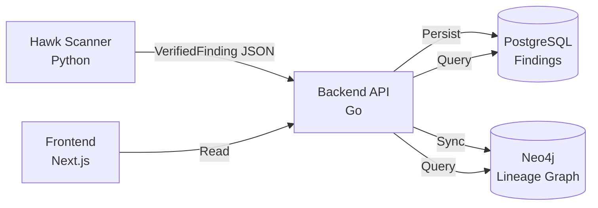
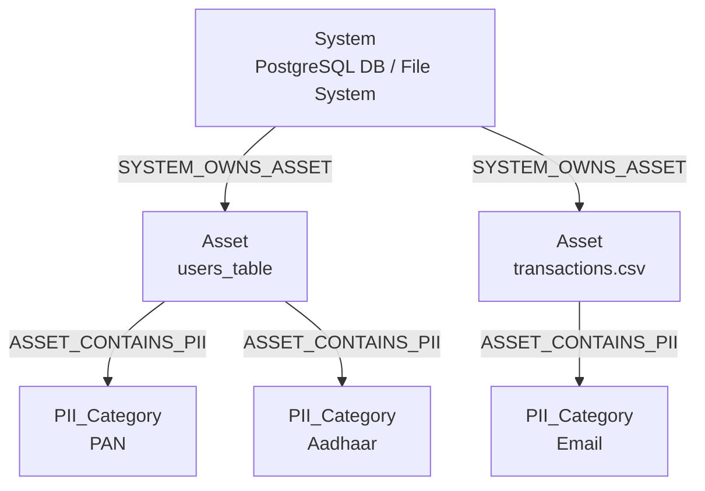
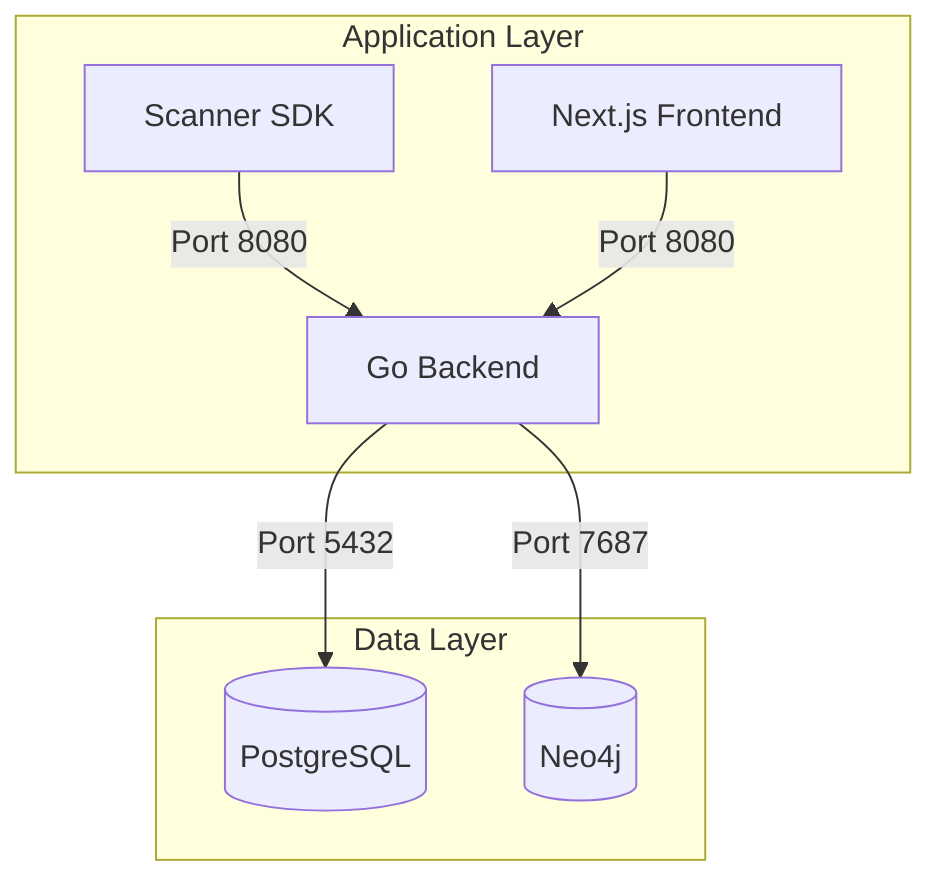

# ARC-Hawk Architecture

## System Overview

ARC-Hawk is a unified platform for Data Lineage and PII Discovery with an "Intelligence-at-Edge" architecture where the Scanner SDK is the sole authority for data classification and validation.

**Version**: 2.1.0  
**Architecture**: 3-Level Semantic Hierarchy

---

## Components

### 1. Hawk Scanner (Python)
- **Purpose**: PII detection, validation, and classification engine
- **Technology**: Python with Presidio, custom validators
- **Capabilities**:
  - Scans filesystems, databases, and cloud storage
  - Mathematical validation for 11 locked Indian PII types
  - Produces `VerifiedFinding` objects with confidence scores
  - CLI-based architecture with auto-ingestion

### 2. Backend Platform (Go)
- **Purpose**: Central processing API and orchestration layer
- **Technology**: Go with Clean Architecture
- **Responsibilities**:
  - Ingestion endpoint for verified findings
  - PostgreSQL persistence
  - Neo4j graph synchronization
  - Lineage API (v2)
  - Health monitoring

### 3. Frontend Dashboard (Next.js)
- **Purpose**: Visualization and management interface
- **Technology**: Next.js, React, TypeScript
- **Features**:
  - Interactive lineage graph visualization
  - Asset inventory management
  - PII findings dashboard
  - Real-time scan monitoring

---

## Data Flow



**Flow Characteristics**:
- ✅ **Unidirectional**: Scanner → Backend → Databases → Frontend
- ✅ **Read-Only Frontend**: No write operations from UI
- ✅ **Single Source of Truth**: Scanner SDK for all classification logic
- ✅ **No Backend Validation**: Backend accepts only pre-verified findings

---

## Lineage Hierarchy (v2.1.0)

### 3-Level Semantic Model



### Node Types

#### 1. System
- **Definition**: Data source or storage system
- **Examples**: PostgreSQL database, MongoDB cluster, File system
- **Properties**: `name`, `type`, `connection_string`

#### 2. Asset
- **Definition**: Specific data container within a system
- **Examples**: Database table, CSV file, JSON document
- **Properties**: `name`, `path`, `asset_type`, `system_id`

#### 3. PII_Category
- **Definition**: Type of PII detected in an asset
- **Examples**: PAN, Aadhaar, Email, Phone, Passport
- **Properties**: `category_name`, `severity`, `count`

### Edge Types

#### SYSTEM_OWNS_ASSET
- **Direction**: System → Asset
- **Meaning**: System contains or owns this asset
- **Cardinality**: One-to-Many

#### ASSET_CONTAINS_PII
- **Direction**: Asset → PII_Category
- **Meaning**: Asset contains instances of this PII type
- **Cardinality**: Many-to-Many

---

## Architecture Evolution

### v2.0 → v2.1.0 Migration

**Previous (Deprecated)**:
```
System → Asset → DataCategory → PII_Category
Edges: CONTAINS, HAS_CATEGORY
```

**Current (v2.1.0)**:
```
System → Asset → PII_Category
Edges: SYSTEM_OWNS_ASSET, ASSET_CONTAINS_PII
```

**Benefits**:
- 🚀 **30-40% faster** lineage queries
- 📉 **790 lines** of code removed
- 🎯 **Clearer semantics** with explicit edge names
- 🔧 **Better OpenLineage alignment**

---

## Technology Stack

| Layer | Technology | Purpose |
|-------|-----------|---------|
| **Scanner** | Python 3.9+, Presidio | PII detection & validation |
| **Backend** | Go 1.21+, Gin, GORM | API & orchestration |
| **Database** | PostgreSQL 15 | Canonical findings storage |
| **Graph DB** | Neo4j 5.x | Lineage relationships |
| **Frontend** | Next.js 14, TypeScript | Visualization dashboard |
| **Infra** | Docker, Docker Compose | Local development |

---

## API Endpoints

### Ingestion
- `POST /api/v1/scans/ingest-verified` - Ingest verified findings from scanner

### Lineage
- `GET /api/v1/lineage/v2` - Retrieve 3-level lineage hierarchy
- `POST /api/v1/lineage/sync` - Trigger manual Neo4j sync

### Health
- `GET /health` - Service health check
- `GET /api/v1/health/neo4j` - Neo4j connectivity check

---

## Security & Compliance

### PII Handling
- ✅ **No Raw PII in Logs**: All logging sanitized
- ✅ **Encrypted Storage**: PostgreSQL with encryption at rest
- ✅ **Access Control**: API authentication required
- ✅ **Audit Trail**: All operations logged

### Validation
- ✅ **Mathematical Validation**: Checksum algorithms for PAN, Aadhaar
- ✅ **Format Validation**: Regex patterns for all PII types
- ✅ **Confidence Scoring**: Multi-signal classification

---

## Deployment Architecture



**Ports**:
- Frontend: `3000`
- Backend: `8080`
- PostgreSQL: `5432`
- Neo4j: `7474` (HTTP), `7687` (Bolt)

---

## Performance Characteristics

| Metric | Value |
|--------|-------|
| **Lineage Query Time** | ~200ms (avg) |
| **Ingestion Throughput** | ~1000 findings/sec |
| **Graph Traversal** | O(n) complexity |
| **Frontend Load Time** | <2s initial load |

---

## References

- [OpenLineage Specification](https://openlineage.io/)
- [Neo4j Graph Data Science](https://neo4j.com/docs/graph-data-science/)
- [Presidio Documentation](https://microsoft.github.io/presidio/)

