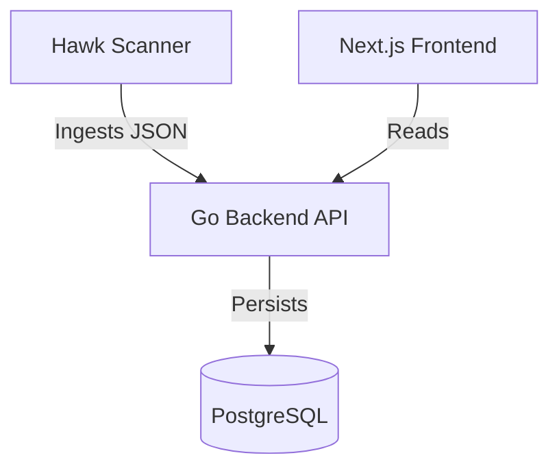

# ARC Hawk Architecture

## System Overview

ARC Hawk is a unified platform for Data Lineage and PII scanning.

### Components

1.  **Hawk Scanner (Python)**
    - Scans filesystems, databases, and cloud storage.
    - Uses regex and OCR to identify PII.
    - CLI-based architecture.

2.  **Backend Platform (Go)**
    - Clean Architecture implementation.
    - Manages ingestion, lineage, and classification data.
    - Exposes REST APIs.

3.  **Frontend Dashboard (Next.js)**
    - Visualization of lineage graphs.
    - Management interface for scans.

### Data Flow

